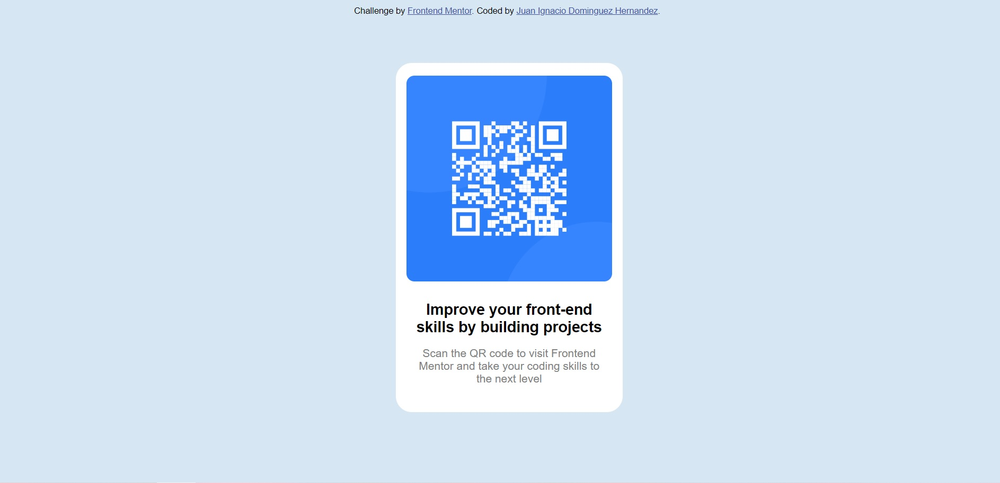

# Frontend Mentor - QR code component solution

This is a solution to the [QR code component challenge on Frontend Mentor](https://www.frontendmentor.io/challenges/qr-code-component-iux_sIO_H). Frontend Mentor challenges help you improve your coding skills by building realistic projects.

## Table of contents

- [Overview](#overview)
  - [Screenshot](#screenshot)
  - [Links](#links)
- [My process](#my-process)
  - [Built with](#Atom,html5,css3)
  - [What I learned](#Como-redondear-los-bordes)
  - [Continued development](#continued-development)
  - [Useful resources](#useful-resources)
- [Author](#JuanDomhe)
- [Acknowledgments](#acknowledgments)

## Overview

### Screenshot

### Links

- Solution URL: [Add solution URL here](https://github.com/JuanDH98/qr-codephone)
- Live Site URL: [Add live site URL here](https://juandh98.github.io/qr-codephone/)

## My process

### Built with

- Semantic HTML5 markup
- CSS custom properties

### What I learned

Una de las cosas que aprendi fue a dar un redondeo a los bordes, ademas de mover bien los div que se iban creando a lo largo del proyecto.

### Useful resources

- [Example resource 1](https://lineadecodigo.com/css/redondear-bordes-con-css/) - Esto para ver como redondear bordes.
- [Example resource 2](https://colorhunt.co/) - Esto para obtener diferentes colores.

## Author

- Website - [Juan Ignacio Dominguez Hernandez](https://github.com/JuanDH98)
- Frontend Mentor - [@yourusername](https://www.frontendmentor.io/profile/yourusername)
- Twitter - [@JuanDomhe](https://twitter.com/JuanDomhe)
